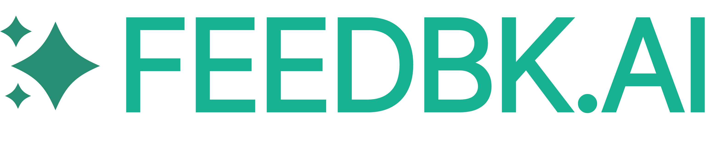

# Feedbk MCP - AI-moderated Interview Skill

[](https://feedbk.ai) [](https://feedbk.ai/en/blog/) [](https://github.com/feedbk-ai/feedbk-skill-mcp/blob/main/LICENSE) [](https://pypi.org/project/feedbk-skill-mcp/)

Create smarter surveys with AI-moderated interviews and intelligent follow-up probing — directly from your AI assistant.

---

## Why Feedbk MCP?

Feedbk MCP brings AI interview/survey creation directly into your workflow:

- ✅ Natural language interview design — just describe what you need
- ✅ Automatic question type detection and configuration
- ✅ Built-in AI probing for deeper insights
- ✅ Create and share interview links with participants instantly

---

## Local vs Remote: Choose Your Workflow

| Feature | Local Install | Remote (`mcp.feedbk.ai`) |
|---------|--------------|--------------------------|
| Create interview guides | ✅ | ✅ |
| Export guides | ✅ | ✅ |
| **Auto-deploy to feedbk.ai** | ❌ | ✅ |
| **Get shareable interview links** | ❌ | ✅ |


---

## Installation

<details open>
<summary><b>Claude Code</b></summary>

```sh
claude mcp add --transport http feedbk https://mcp.feedbk.ai/mcp
```

</details>

<details>
<summary><b>VS Code</b></summary>

Add to your VS Code MCP settings:

```json
"mcp": {
  "servers": {
    "feedbk": {
      "type": "http",
      "url": "https://mcp.feedbk.ai/mcp"
    }
  }
}
```

</details>

<details>
<summary><b>Claude Desktop</b></summary>

Navigate to **Settings** → **Connectors** → **Add Custom Connector**, then enter:
- **Name**: `Feedbk`
- **URL**: `https://mcp.feedbk.ai/mcp`

</details>

<details>
<summary><b>OpenAI ChatGPT</b></summary>

> Requires ChatGPT Pro, Team, Enterprise, or Edu subscription

1. Go to **Settings** → **Connectors**
2. Enable **Developer Mode** under Advanced settings
3. Click **Create** and enter:
   - **Name**: `Feedbk`
   - **Server URL**: `https://mcp.feedbk.ai/mcp`
4. In a new chat, click **+** → **More** → **Developer Mode** and enable Feedbk

</details>

<details>
<summary><b>Google Gemini CLI</b></summary>

```sh
gemini mcp add feedbk --url https://mcp.feedbk.ai/mcp
```

</details>

<details>
<summary><b>OpenAI Codex CLI</b></summary>

```sh
codex mcp add feedbk --url https://mcp.feedbk.ai/mcp
```

</details>

---

## Usage

Just ask your AI assistant to create an interview:

```
Create a customer satisfaction survey about our mobile app
```

```
Build a user research interview to understand why users cancel their subscriptions
```

```
Design an employee feedback survey about remote work preferences
```

The skill will guide you through:

1. **Interview Name** — What are you calling this survey?
2. **Purpose** — Why are you conducting this? (one sentence)
3. **Questions** — What do you want to ask?

---

## Question Types

### AI Probing

> Feedbk's AI interviewer automatically asks intelligent follow-up questions based on responses — no manual configuration needed.

### Single-Choice
```
"What is your preferred method of communication?"
Options: Email / Phone / Text / Video Call
```

### Multiple-Choice
```
"Which features do you use? (Select all)"
Options: Dashboard / Reports / Analytics / Integrations
```

### Open-Ended Text
```
"What's your biggest challenge with our product?"
Response: Free text
```

### Rating (Likert Scale)
```
"How satisfied are you with our service?"
Scale: 1 (Very Dissatisfied) → 5 (Very Satisfied)
```

---


## Connect with Us

- Website: [feedbk.ai](https://feedbk.ai)
- Documentation: [blog](https://feedbk.ai/en/blog/)

---

## License

MIT
